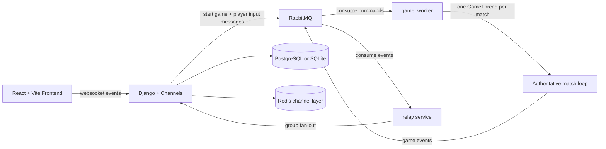
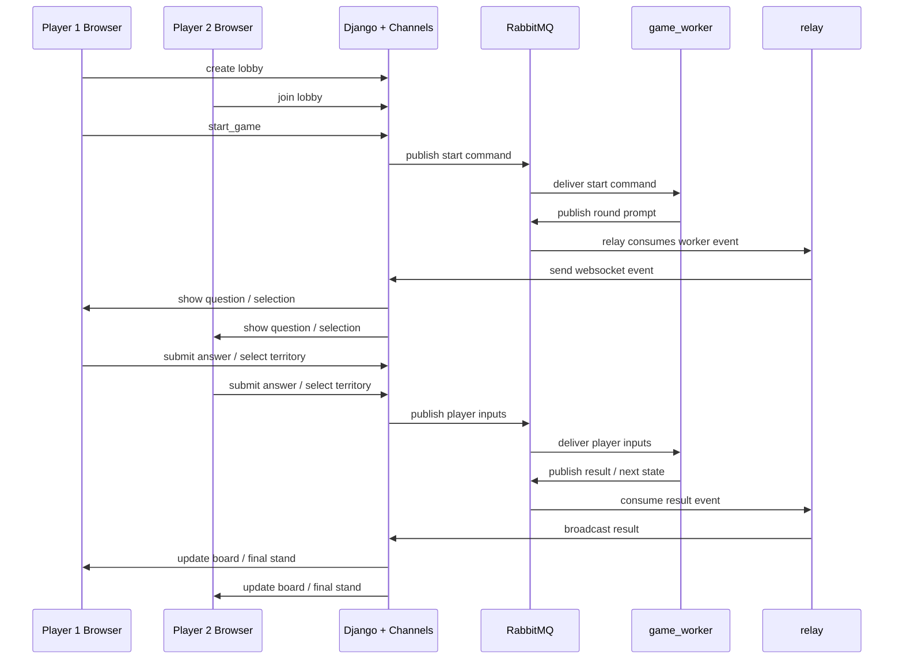

# OTA: Open Trivia Arena

OTA is a 1v1 territory-control trivia game inspired by Triviador. The stack combines Django, Channels, RabbitMQ, Redis, a standalone Python game worker, and a React + Vite frontend.

Players create named lobbies, configure the match, and play through a synchronized loop of base selection, expansion, duels, and castle sieges. The browser renders the game, but the worker owns the game state and resolves every round.

## Highlights

- Named private lobbies instead of queue-only matchmaking.
- Configurable categories, difficulties, question types, map size, timer, and battle-round cap.
- `multiple choice`, `true/false`, and `estimate` question modes.
- Worker-authoritative gameplay with realtime updates over websockets.
- Expansion, duel, and castle-siege phases on a hex map.
- Final results based on the current game mode and end condition.
- Optional sound effects loaded from `frontend/public/sounds/`.

## Tech stack

- Backend: Django 5 + Channels
- Frontend: React 18 + Vite
- Messaging: RabbitMQ
- Realtime transport: websockets via Daphne
- Channels layer: Redis
- Database: PostgreSQL in Docker, SQLite for lightweight local fallback
- Game runtime: standalone Python worker threads

## How it works

The application is split into a few clear responsibilities:

- `web`: Django HTTP + websocket entrypoint
- `relay`: consumes worker events from RabbitMQ and forwards them to Channels groups
- `game_worker`: runs the authoritative match loop
- `matchmaker`: background worker process kept in the stack for worker-side orchestration
- `frontend`: Vite development server for the client
- `db`, `broker`, `redis`: infrastructure services

Realtime flow:

1. The frontend connects to `/ws/matchmaking/` for identity, lobbies, and lobby actions.
2. Starting a match publishes a worker command through RabbitMQ.
3. The worker creates and runs the match thread.
4. Player answers and territory selections are sent back through RabbitMQ inputs.
5. The worker publishes match events.
6. The relay forwards those events to websocket groups.

## Architecture diagram



## Match sequence diagram



## Gameplay rules

Each match follows this sequence:

1. Host creates a lobby and selects match settings.
2. A second player joins.
3. Both players see a synchronized start countdown.
4. Players answer for base-pick priority and choose home bases.
5. Expansion rounds distribute neutral hexes.
6. Battle rounds resolve attacks and castle sieges.
7. The worker decides the winner and publishes final results.

Current scoring behavior:

- Normal trivia rounds are won by the fastest correct answer.
- `Estimate` rounds are won by the closest valid answer; speed is only a tie-break.
- Final result screens display `won questions`, not only literal exact-correct answers.
- Battle-round-limit results use `hexes > castle hp > won questions` as the tie-break order.
- Conquest results prioritize the player who captures the opposing castle.

Expansion behavior:

- Neutral claims must be adjacent to any territory the player already owns.
- If a player is fully blocked and has no adjacent neutral hex, they may choose any neutral hex.

## Repository layout

- `frontend/`: React client and styles
- `web/`: Django project
- `web/apps/realtime/`: websocket consumers, relay integration, and web-side RabbitMQ publisher
- `worker/`: match worker, game thread, matchmaker, and worker-side RabbitMQ utilities
- `opentdb-scrape/`: question CSV data and helper scripts
- `docker/`: container entrypoints and support scripts

## Quick start

Recommended development path: run the stack through Docker Compose.

### 1. Prepare env files

Copy the root env template:

```bash
cp .env.example .env
```

On Windows PowerShell:

```powershell
Copy-Item .env.example .env
```

### 2. Start the stack

```bash
docker compose up --build
```

### 3. Apply migrations

```bash
docker compose exec web python manage.py migrate
```

### 4. Open the app

- Frontend dev server: `http://localhost:5173`
- Django HTTP: `http://localhost:8000`
- Websocket backend: `ws://localhost:3000`
- RabbitMQ management UI: `http://localhost:15673`

Useful commands:

```bash
docker compose ps
docker compose logs web game_worker matchmaker relay frontend --tail=100
docker compose down --remove-orphans
```

## Fresh start mode

Guest players and lobbies are intentionally persistent until you clear them. For demos, local testing, or recorded runs, the web container supports a one-shot fresh-start flag on boot.

Normal startup:

```bash
docker compose up --build
```

Fresh start startup:

```bash
FRESH_START=1 docker compose up --build
```

On Windows PowerShell:

```powershell
$env:FRESH_START=1
docker compose up --build
Remove-Item Env:FRESH_START
```

What gets cleared:

- all matches
- all lobbies
- all guest players

The reset runs once per web-container boot, after migrations and before Gunicorn/Daphne start.

You can also run the reset manually:

```bash
docker compose exec web python manage.py reset_demo_state # clears matches, lobbies and guest players
docker compose exec web python manage.py reset_demo_state --dry-run # see what would get deleted
docker compose exec web python manage.py reset_demo_state --keep-guests # do not delete guest players
```

## Local checks without Docker

Backend sanity check from the local virtual environment:

```powershell
Set-Location web
../.venv/Scripts/python.exe manage.py check
```

Frontend production build:

```powershell
Set-Location frontend
npm run build
```

## Netlify deployment

The frontend is static and can be deployed to Netlify.

### Build the frontend

From `frontend/`:

```bash
npm install
npm run build
```

Upload `frontend/dist/` to Netlify.

### Point the frontend to the backend

Create `frontend/.env.production` from `frontend/.env.production.example` and set:

```bash
VITE_WS_BASE=wss://your-ngrok-subdomain.ngrok-free.app
```

The frontend speaks to the backend over websocket URLs directly, so `wss://...` is the correct public target.

### Expose the backend with ngrok

Expose only the websocket backend port:

```bash
ngrok http 3000
```

Then allow that hostname in `.env`:

```bash
DJANGO_ALLOWED_HOSTS=localhost,127.0.0.1,your-ngrok-subdomain.ngrok-free.app
```

## Questions and content

Runtime questions are loaded from CSV files under `opentdb-scrape/data/`.

Supported question modes:

- `multiple choice`
- `true/false`
- `estimate`

The helper script for numeric-question extraction is in `opentdb-scrape/find_numeric_questions.py`.

## Audio assets

The frontend looks for optional sound files in `frontend/public/sounds/`.

Expected filenames:

- `button-click.mp3`
- `lobby-start-countdown.mp3`
- `question-start.mp3`
- `selection-lock.mp3`
- `territory-claim.mp3`
- `answer-correct.mp3`
- `answer-wrong.mp3`
- `match-finished.mp3`

If any of them are missing, the app still runs.

## Main implementation files

- `frontend/src/app.jsx`: main UI and websocket orchestration
- `frontend/src/styles.css`: UI styling
- `web/apps/realtime/consumers.py`: lobby and match websocket consumers
- `web/apps/realtime/publisher.py`: web-side queued RabbitMQ publisher
- `worker/game_thread.py`: authoritative game logic
- `worker/game_worker.py`: worker service that owns active matches
- `worker/mq.py`: worker-side RabbitMQ publisher helpers
- `worker/question_provider.py`: CSV-backed question loading and lobby metadata
